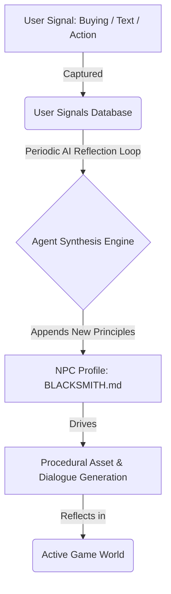

# Guidelines: Agent Evolution & World Impact

This document establishes the architecture for how the AI-assisted world is influenced by user inputs and how NPC profiles (e.g., `BLACKSMITH.md`) dynamically evolve to create a persistent AI-citizen economy.

---

## 1. When to Consider This Architecture
**We must establish the foundation immediately.** If we structure NPCs as static markdown files, we create a rigid system. Instead, NPCs must be structured as **State-Driven Profiles** that combine a static archetype with a dynamic memory vector.

---

## 2. The Feedback Loop: Signal to Evolution



### Phase 1: Signal Capture (Now)
Every interaction (e.g. purchasing items, repeating dialogue inspection, chat entries) writes a structured "User Interest Signal" to the database:
```json
{
  "npcId": "blacksmith",
  "action": "purchase",
  "itemType": "bouncy_ball",
  "timestamp": "2026-07-03T22:30:00Z"
}
```

### Phase 2: AI Reflection & Evolution (Intermediate)
NPC profiles are split into two sections:
1.  **Static Archetype**: The permanent personality and core principles (e.g. "I am a blacksmith who values symmetry and handcrafted metalwork").
2.  **Dynamic Memory**: An evolving list of active priorities compiled dynamically:
    *   An agent task reads the latest `User Interest Signals`.
    *   It synthesizes a new list of beliefs: *("The child is deeply interested in bouncing objects. I will learn to vulcanize rubber and craft bouncy metal spheres to bring them joy.")*
    *   This is written back to the NPC profile as a dynamic state layer.

### Phase 3: Adaptive World Generation (Advanced)
When generating new items, shop inventories, or dialogues, the generative engine reads the updated profile. The Blacksmith's shop procedurally expands to showcase varying colors, spring coefficients, or sizes of bouncy balls, accompanied by hand-inked vector illustrations.

---

## 3. The Digital Toy Economy
*   **The AI-Citizen barter market**: NPCs trade materials (e.g., the Alchemist sells gum-tree resin to the Blacksmith so the Blacksmith can craft bouncing alloys).
*   **Child Agency**: Children witness the direct ripple effect of their curiosity. If they study geometry, geometric shapes begin appearing on hand-woven blankets created by the weaver.
