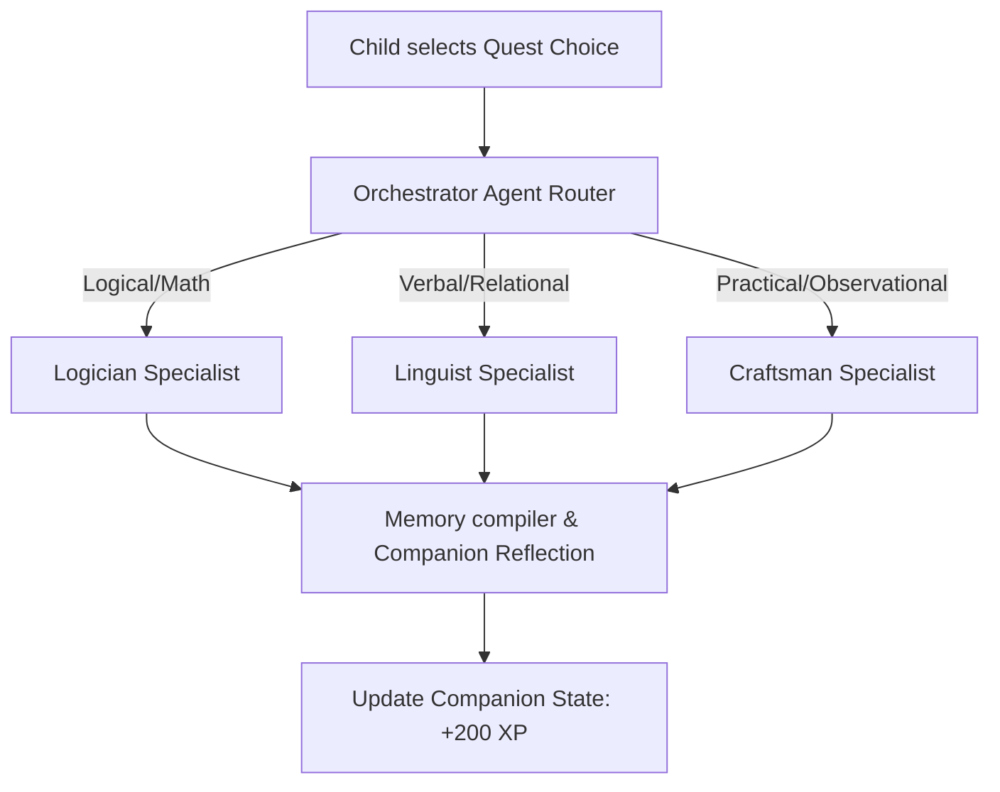

# Cabbits Kaggle Capstone Submission Writeup

Welcome to the official capstone submission writeup for **Cabbits**. This document contains your submission outline, rationale, architecture detail, and video script to prepare for your final portfolio review.

---

## 1. Rationale (Why Cabbits?)

Most early learning applications separate the educational material (e.g. flashcards, quizzes) from the game world. The child is either playing or studying, but rarely both at once. 

**Cabbits** is a *companion-first* learning agent designed for children. Education is presented not as a separate chore, but as an interactive ability of their virtual companion, **Pip**. By reinforcing reasoning, language, and practical exploration, the child collaborates with Pip to solve problems in a living world. Every observation and decision awards XP, helping Pip level up, grow stats, and acquire new items.

### Core Rationale Elements:
- **Claymorphic Aesthetics**: Warm, hand-sculpted clay visuals that evoke a tactile, toy-like comfort, distinct from cold modern vector-art apps.
- **Spec-Driven Agent Development**: Build Cabbits as a reference implementation of clean, spec-driven development where state changes, memories, and agent specialists are tied to explicit typescript contracts.
- **Logic-First Learning Loop**: Encourages children to view logical, verbal, and practical approaches as different equally valid tools to resolve problems in their world.

---

## 2. Technical Agent Architecture

Cabbits runs an **Orchestrator-Specialist-Compiler** multi-agent cycle to reinforce child problem solving:

### Core Components:
1. **The Orchestrator Router**: Inspects the incoming child decision and determines which intelligence specialist is best suited to evaluate the action.
2. **The Intelligence Specialists**:
   - **Logician**: Verifies patterns, math, and deductive consistency.
   - **Linguist**: Evaluates semantics, storytelling, and empathy.
   - **Craftsman**: Confirms physical mechanics, sorting, and observational facts.
3. **The Compiler & Reflection Agent**: Synthesizes the specialist's feedback into a warm, encouraging quote spoken directly by Pip, compiling it into the child's Journal.

---

## 3. Dynamic Living World Systems

- **Reactive Weather & Calendar**: Clicking the Carrot Calendar cycles weather sequentially, while clicking the Bed cycles weather randomly (avoiding duplicates). The bedroom scene is updated with beautiful blur-focus transitions.
- **Reactive Ambient Soundtrack**: Integrates a persistent HTML5 audio system that shifts tracks automatically:
  - Cozy bedroom page (`K02-06.mp3` theme)
  - Active exploration/quests maps (`ravenshadow-audio.mp3` theme)
- **Set-Completion Reset Loop**: When all three landmarks in a location are completed, the companion provider resets completion statuses and generates a randomized set of quest templates to keep exploration fresh.

---

## 4. Codebase Reference Directory

Use these links to refer directly to key files in your Kaggle submission writeup:

- **State & Growth Engine**: [CompanionProvider.tsx](file:///Users/johnhansen/Desktop/1-aether-creative-studio/cabbits/components/providers/CompanionProvider.tsx) — Houses completeQuest choice evaluation, XP leveling, stats scaling, and set-completion randomization.
- **Themed Quests Pool**: [quests.ts](file:///Users/johnhansen/Desktop/1-aether-creative-studio/cabbits/lib/data/quests.ts) — Mapped templates for Logical, Verbal, and Practical intelligence options.
- **Landmark Exploration Map**: [app/explore/page.tsx](file:///Users/johnhansen/Desktop/1-aether-creative-studio/cabbits/app/explore/page.tsx) — Implements interactive landmark pins and detailed quest cards.
- **Chamber Quest UI**: [app/quest/page.tsx](file:///Users/johnhansen/Desktop/1-aether-creative-studio/cabbits/app/quest/page.tsx) — Renders the clay approach cards and displays specialist feedback logs.
- **Audio Sound Manager**: [MainShell.tsx](file:///Users/johnhansen/Desktop/1-aether-creative-studio/cabbits/components/layout/MainShell.tsx) — Drives context-aware background music.

---

## 5. Video Script Walkthrough (3-5 Minutes)

### Phase 1: Intro & Cozy Room (0:00 - 1:00)
- **Show on Screen**: The home bedroom page.
- **What to Say**: 
  > *"Hi everyone, this is Cabbits, an early learning companion agent built for children. This is our companion, Pip, sitting in his cozy isometric bedroom. We wanted the environment to feel alive, so children can toggle weather conditions. Toggling the calendar changes weather dynamically, and putting Pip to sleep shifts the room into night mode. We've also added a custom ambient soundtrack that shifts smoothly as we navigate the world."*

### Phase 2: Explore Map & POIs (1:00 - 2:00)
- **Show on Screen**: Click the Window to transition to the Explore Map. Hover over Crescent Pond and click it to open the local map.
- **What to Say**:
  > *"If we navigate to the Explore map, we see our locations like Crescent Pond. When we enter, we are greeted by three points of interest or landmarks. The user can tap any pin to load its active quest on the right. Let's start the Golden Lilies quest."*

### Phase 3: Quest Chamber & Intelligence Choice (2:00 - 3:00)
- **Show on Screen**: Click 'Begin Quest'. Show the 3 clay card choices (Logic, Relational, Practical). Click the Relational approach.
- **What to Say**:
  > *"In the Quest Chamber, instead of a boring multiple-choice test, the child is presented with three positive approaches: Logical, Relational, or Practical. Let's pick the Relational option to talk to the pond frogs. Clicking it triggers our Agent Orchestrator, simulating the routing of Pip's thoughts to our Linguist specialist, who evaluates the solution and writes it directly to Pip's memories."*

### Phase 4: Level Up & Outro (3:00 - 4:00)
- **Show on Screen**: Show the Completed page. Return home. Click feed or check stats to trigger a Level Up modal, or explain how stats scale.
- **What to Say**:
  > *"Completing quests awards +200 XP. Once Pip's XP exceeds the level threshold, he levels up! Stat increases (Health, Learning, Kindness, Energy) scale dynamically, and a celebration modal is triggered. That completes the core learning loop of Cabbits—a spec-driven companion app where logic-first exploration drives companion growth. Thanks for watching!"*
